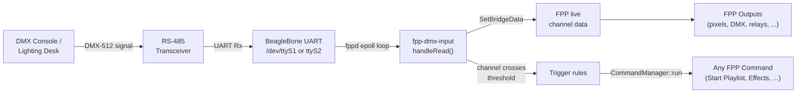
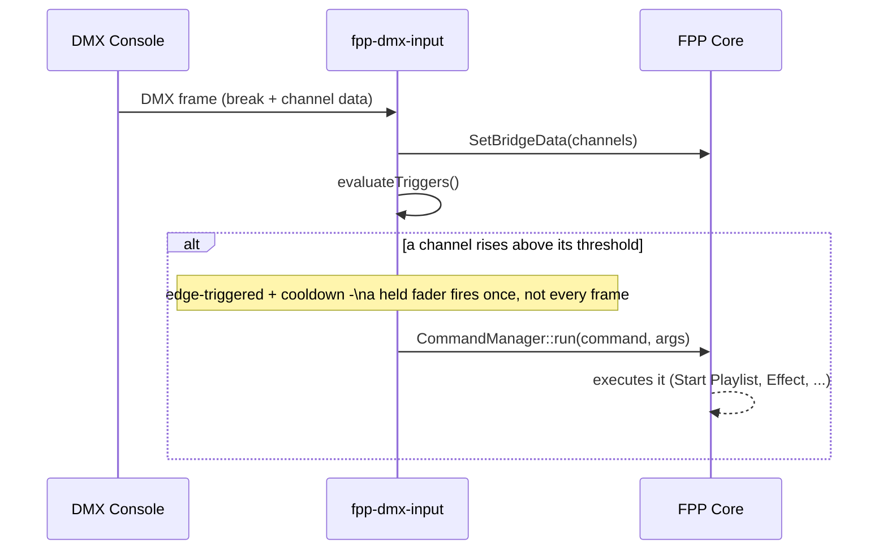
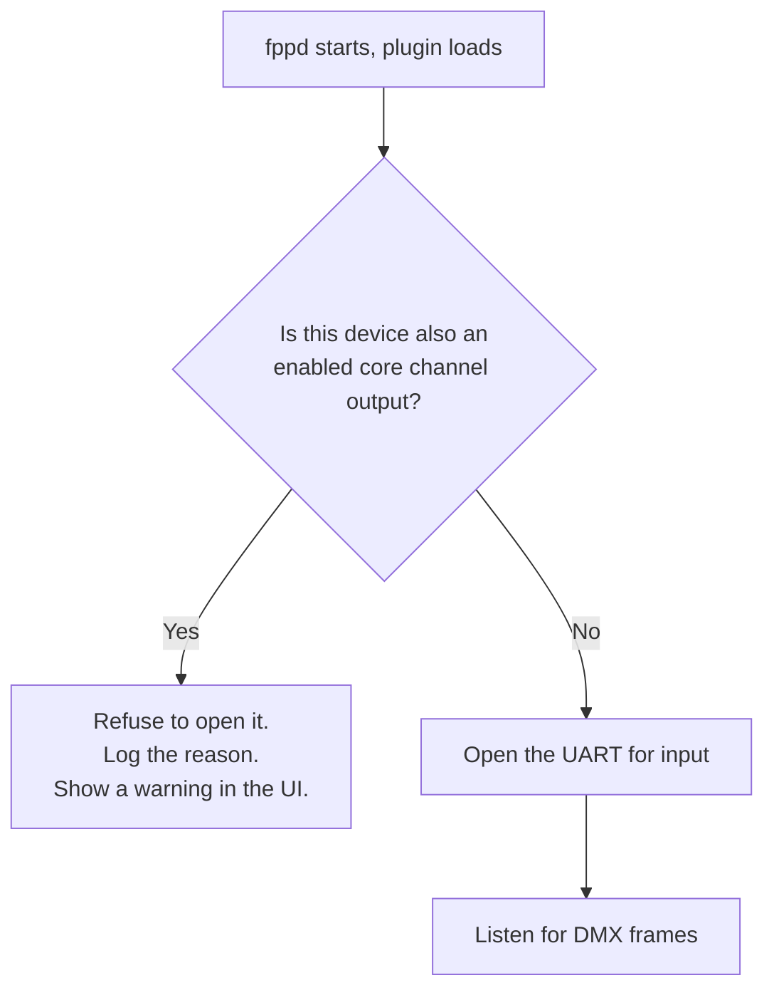

# fpp-dmx-input

A C++ plugin that adds DMX-512 **receive** to FPP 5.x, which has no built-in
"Channel Input" feature (that was added natively in FPP 8.2). It reads a
UART wired as an RS-485 receiver and feeds the decoded universe straight
into FPP's live channel data through `Sequence::SetBridgeData()` — the same
call FPP's own E1.31/ArtNet/DDP bridges use, with the same "stale data
expires and stops overriding output" behavior.

On top of receiving DMX, it can also **trigger any FPP Command** — start a
playlist, run an effect, adjust volume, anything in FPP's own command list —
from a DMX channel crossing a threshold, configured through the same
Command Editor popup the "Run FPP Command" button uses.

## How it works



- `addControlCallbacks()` opens the configured serial device via FPP's own
  `SerialOpen()` (from `channeloutput/serialutil.h`, linked in from
  `libfpp.so`), which already knows how to set DMX's non-standard 250000
  baud rate. It then adds `BRKINT` on the fd itself, since FPP 5.x's
  `SerialOpen()` doesn't set that for input mode — `BRKINT` is what makes a
  real UART break condition show up as a single `0x00` byte in the read
  stream, which is how DMX frame boundaries are found.
- The registered fd is added to fppd's own `epoll` loop, so the plugin's
  read callback fires whenever new bytes are waiting — no polling thread.
- Each full frame gets copied into FPP's channel data at the configured
  start channel via `sequence->SetBridgeData(...)`, and checked against any
  configured trigger ranges.

### Trigger firing



## Features

- **Two input slots**, matching the two physical DMX ports most BeagleBone
  capes expose. Each has its own device, start channel, channel count, and
  bridge-data expiry.
- **Any number of triggers** (soft cap 64) — each watches a channel range
  and runs an FPP Command when a channel rises above a threshold. Configured
  through FPP's own real Command Editor popup (typed, per-argument form
  fields — dropdowns for enums, checkboxes for bools, live-populated lists
  for things like playlist/effect names) rather than a free-typed string.
- **Live status page** — packets/bytes/errors received per input, signal
  state, and trigger fire counts, auto-refreshing every 2 seconds without a
  full page reload.
- **Port-conflict protection** — refuses to open a device that's also
  configured as an active core channel output, with a warning that updates
  live in the config UI as you change settings (see below).
- **JSON status API** at `GET /DMXInput/status` on fppd's own port (32322)
  for anything else you want to build on top.

## A UART can't be an input and a core output at the same time



This isn't just caution: `SerialOpen()`'s exclusivity check (`TIOCEXCL`) is
bypassed for root, and `fppd` runs as root, so without this check both
sides would silently get a real file descriptor on the same UART — no
error from either side (confirmed by direct test: `fppd` stayed up,
`/proc/<pid>/fd` showed two live descriptors on one device). On a
half-duplex RS-485 port that's not just a software issue: the output side
continuously drives DE/RE to transmit, so a DE/RE-jumpered-to-GND input
can't get a genuine external signal through (most transceivers just echo
their own TX back on RO), and the DE/RE line itself ends up contested
between the two — the same class of pin contention that causes DE/RE
overheating on floating/miswired lines.

The warning shows two places:
- **Content Setup → DMX Input Configuration** — live, updates the instant
  you change a Device or Enabled field, before you've even saved.
- **Status/Control → DMX Input - Status** — reflects fppd's actual runtime
  state, in case the conflicting output was changed after the plugin loaded.

## Hardware wiring

This plugin needs a UART **Rx** pin actually wired to the RS-485
transceiver's RO pin — DMX output-only wiring doesn't give you that. Check
which `/dev/ttyX` device corresponds to which physical port on your board —
BeagleBone kernels use either `ttyO*` (TI legacy) or `ttyS*` (mainline)
naming depending on the image, and `/dev/ttyO*` is usually just a symlink
to the matching `/dev/ttyS*`.

Whichever port you use for input, its DE/RE control must be set to **GND**
(listen mode) — a driver actively transmitting can't simultaneously receive
a real external signal on the same differential pair. If your board has a
DE/RE jumper header, that's the GND position; some transceiver circuits tie
DE/RE to a GPIO instead, in which case that pin needs to be driven low.

## Installation

### Option 1 — FPP's Plugin Manager

Since this plugin isn't in FPP's built-in community plugin list, add it
manually: open the Plugin Manager page, and in the search box
("Find a Plugin or Enter a plugininfo.json URL") paste this **raw**
`pluginInfo.json` URL:

```
https://raw.githubusercontent.com/joeskolengaden/fpp-dmx-input/main/pluginInfo.json
```

That's not the repo page URL — FPP fetches this URL directly as JSON to
learn the plugin's name/description and where to `git clone` it from
(`srcURL` in that file), so it has to resolve to the raw file content, not
a GitHub webpage. Once it loads, click Install as normal; that clones
`https://github.com/joeskolengaden/fpp-dmx-input.git` into
`/home/fpp/media/plugins/fpp-dmx-input/` and runs `scripts/fpp_install.sh`.

### Option 2 — manual install (SSH)

```bash
cd /home/fpp/media/plugins
git clone https://github.com/joeskolengaden/fpp-dmx-input.git
cd fpp-dmx-input
./scripts/fpp_install.sh
```

Either way this builds `libfpp-dmx-input.so` against your FPP install
(`SRCDIR=/opt/fpp/src`). Restart fppd (or reboot) afterward — `fppd` loads
plugins via `dlopen()` at startup, so a running instance won't pick up a
freshly-built or freshly-installed plugin without a restart.

### Updating

```bash
cd /home/fpp/media/plugins/fpp-dmx-input
git pull
make SRCDIR=/opt/fpp/src
sudo /opt/fpp/scripts/fppd_restart
```

## Configuration

Everything is configurable from the FPP web UI once installed — **Content
Setup → DMX Input Configuration** for inputs and triggers, **Status/Control
→ DMX Input - Status** for live status. No manual file editing needed.

For reference, inputs are stored as plain `key=value` lines in
`/home/fpp/media/config/plugin.fpp-dmx-input`:

| Key | Default | Meaning |
|---|---|---|
| `label0` / `label1` | `DMX1` / `DMX2` | Display name for each input slot. |
| `device0` / `device1` | `ttyS1` / `ttyS2` | UART under `/dev/` to read from. |
| `enabled0` / `enabled1` | `0` (off) | Must be explicitly turned on — see the port-conflict note above. |
| `startChannel0` / `1` | `1` | First DMX channel (1-based) to write into FPP's channel data. |
| `channelCount0` / `1` | `512` | How many channels to copy from the incoming universe. |
| `expireMS0` / `1` | `5000` | How long injected data stays live after the last received frame before FPP treats it as stale. |

Triggers are stored separately, as a JSON array (since the count is
user-defined, not fixed) at
`/home/fpp/media/config/plugin.fpp-dmx-input-triggers.json`:

```json
{ "triggers": [
    { "enabled": true, "startChannel": 100, "endChannel": 105,
      "threshold": 50, "command": "Start Playlist",
      "args": ["MyShow", "false", "false", "0"], "cooldownMs": 2000 }
] }
```

## Known limitation

Break detection uses a millisecond-resolution timing heuristic (a >3ms gap
plus a `BRKINT` marker byte = new frame), ported directly from FPP's own
upstream DMX-input implementation (`e131bridge.cpp`, which uses the same
heuristic at microsecond resolution). This is a heuristic, not spec-exact
break/MAB timing — it works because DMX transmitters produce a consistent,
much-larger-than-3ms gap at the start of every frame, but a non-compliant
or very unusual DMX source could in theory confuse it.

## License

MIT
